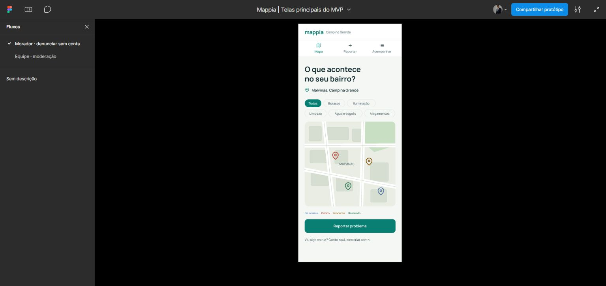
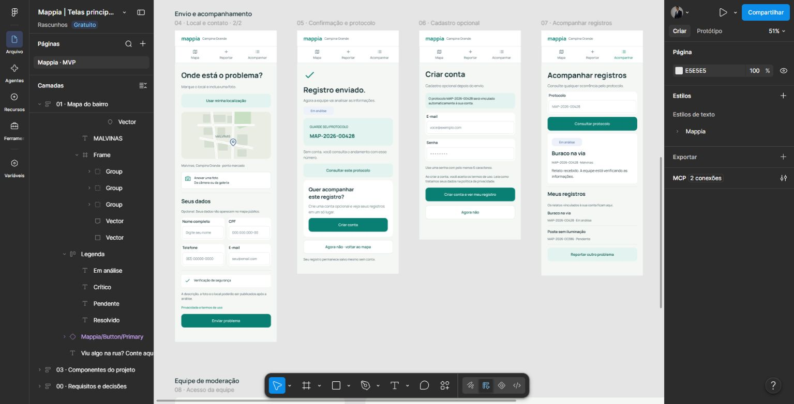

# Mappia

**Projeto de extensão · Comunidade e tecnologia · Protótipo em Figma**

O Mappia explora como a tecnologia pode apoiar a comunidade na identificação e no acompanhamento de problemas do bairro. A proposta visual apresenta um mapa, o registro de ocorrências e uma consulta por protocolo, aproximando participação cidadã e organização do atendimento.

## Protótipo

[Abrir telas no Figma](https://www.figma.com/design/IY3T4Dv7QenJZWPRxngnf3).

## Fluxos desenhados

- Explorar o mapa e consultar uma ocorrência.
- Informar problema, localização e foto.
- Receber um protocolo e acompanhar o registro.
- Criar uma conta opcional após o envio.
- Consultar indicadores e visualizar a área de moderação.

Esses itens são funcionalidades propostas nas telas. Ainda não há aplicação, backend ou serviço de atendimento implementados neste repositório.

## Documentação do projeto

| Documento | Situação |
|---|---|
| [PRD](docs/prd/README.md) | Espaço reservado para a versão que será fornecida pelo autor |
| [Product Backlog](docs/product-backlog/README.md) | Espaço reservado para a versão que será fornecida pelo autor |
| Protótipo | Telas disponíveis no Figma e exportações em `prototipo/` |

## Próximas etapas

Consolidar o PRD e o Product Backlog, validar a proposta com a comunidade e definir o escopo da primeira implementação.

## Autoria e contexto

João Vitor Regis · Projeto de extensão voltado à comunidade e tecnologia. Créditos dos integrantes e da instituição podem ser acrescentados com a documentação oficial da equipe.
